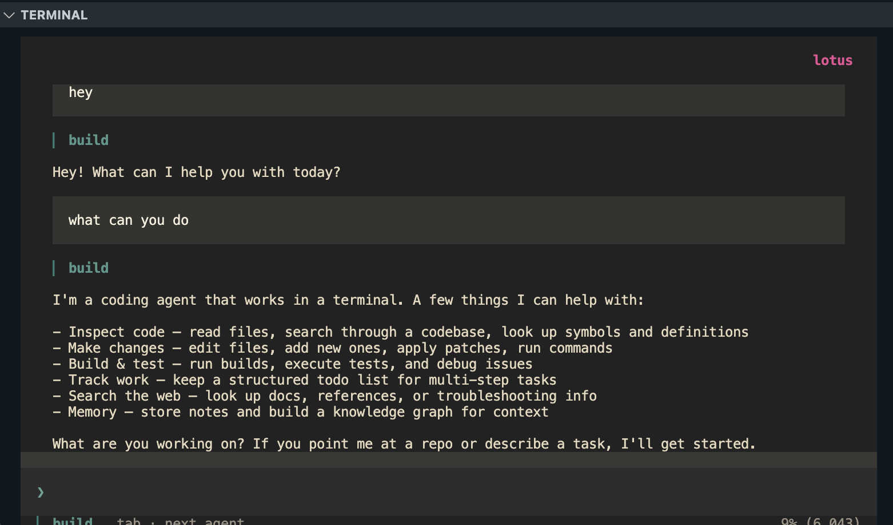

# Lotus

A terminal-based AI pair programmer, built with an MVC architecture on Google Cloud. Single-user by design, four LLM providers, first-class MCP support.

<p align="center">
  
</p>

## Features

- **Full terminal UI** — SolidJS + OpenTUI, keyboard-driven, warm paper light theme and neutral dark theme
- **MVC architecture** — strict layer boundaries enforced by ESLint
- **4 LLM providers** — Anthropic (Claude), Vertex AI (Gemini), DeepSeek, Ollama
- **Google Cloud backend** — Firestore sessions, Secret Manager credentials, Cloud Storage exports, Cloud Logging
- **MCP support** — Model Context Protocol client with OAuth; MCP tools are merged into the LLM's tool catalog so the model can call them directly
- **Built-in tools** — bash, file ops, web, LSP, subagents, and more
- **Named agents** — configurable system prompts, models, and permissions per agent
- **Session history** — persistent across machines via Firestore
- **Slash commands** — `/agent`, `/mcp`, `/theme`, `/rename`, `/compact`, `/timeline`, and more
- **@ file mentions** — fuzzy-search files from the current project and drop them into your prompt inline

## Requirements

- [Bun](https://bun.sh) 1.3+
- [Google Cloud CLI](https://cloud.google.com/sdk/docs/install) with a GCP project
- (Optional) [Ollama](https://ollama.ai) for local models

## Installation

```bash
git clone https://github.com/yourusername/lotus
cd lotus
bun install
```

## GCP Setup

```bash
# Authenticate with GCP
gcloud auth application-default login

# Enable required APIs
gcloud services enable firestore.googleapis.com \
  secretmanager.googleapis.com \
  storage.googleapis.com \
  aiplatform.googleapis.com \
  logging.googleapis.com
```

Add a `gcp` block to your project's `lotus-code.json`:

```jsonc
{
  "gcp": {
    "projectId": "your-gcp-project-id",
    "region": "us-central1"
  },
  "provider": {
    "anthropic": { "apiKey": "sk-ant-..." },
    "deepseek":  { "apiKey": "sk-..." }
  }
}
```

> Vertex AI and Ollama require no API key — Vertex uses your GCP credentials, Ollama runs locally.

## Usage

```bash
# Open the interactive TUI
bun run dev

# Run a single prompt (non-interactive)
bun run dev -- run "explain this codebase"

# Session management
bun run dev -- session list
bun run dev -- session delete <id>

# Export a session to Cloud Storage
bun run dev -- export <sessionID>

# Provider and model management
bun run dev -- providers
bun run dev -- models

# MCP servers
bun run dev -- mcp list
bun run dev -- mcp add <name>
```

## Selecting a Model

```bash
bun run dev -- --model anthropic/claude-sonnet-4-6
bun run dev -- --model vertex-ai/gemini-2.0-flash-001
bun run dev -- --model deepseek/deepseek-chat
bun run dev -- --model ollama/llama3.2
```

## Slash Commands

Type `/` in the TUI to browse. Highlights:

- `/agent` — list, switch to, delete, or create a new agent (name → description → mode)
- `/mcp` — list connected MCP servers (with status), reconnect, delete, or add a new local server (name → command → env)
- `/theme` — pick Light or Dark; stored in `~/.lotus-code/config.json` (restart to apply)
- `/rename` — rename the current session
- `/compact` — summarize the session to shrink the context window
- `/timeline` — jump to a message in the transcript

## Agents

Configure agents in `lotus-code.json`, drop an `AGENTS.md` in your project root, or create them interactively via `/agent`:

```jsonc
{
  "agents": {
    "build": {
      "system": "You are a senior TypeScript engineer focused on correctness and simplicity.",
      "model": "anthropic/claude-sonnet-4-6",
      "permissions": ["bash", "read", "edit", "glob", "grep"]
    },
    "reviewer": {
      "system": "You review code for security issues and performance problems only.",
      "model": "vertex-ai/gemini-2.5-pro-preview-06-05",
      "mode": "subagent",
      "permissions": ["read", "glob", "grep"]
    }
  }
}
```

Built-in agents: `build` (default), `plan`, `explore`, `general`, plus the internal `compaction` / `title` / `summary` helpers.

## MCP Servers

Local (subprocess) or remote (URL). Add via `/mcp` or by editing `lotus-code.json`:

```jsonc
{
  "mcp": {
    "memory": {
      "type": "local",
      "command": ["npx", "-y", "@modelcontextprotocol/server-memory"],
      "environment": {
        "MEMORY_FILE_PATH": "/absolute/path/to/memory.json"
      }
    },
    "github": {
      "type": "local",
      "command": ["npx", "-y", "@modelcontextprotocol/server-github"],
      "environment": { "GITHUB_PERSONAL_ACCESS_TOKEN": "ghp_..." }
    }
  }
}
```

Connected servers' tools appear directly in the LLM's tool catalog (namespaced `{server}_{tool}`), so the model can call them like any built-in.

## Development

```bash
bun run dev          # run the TUI in development mode
bun test             # run tests (no GCP needed — uses in-memory layer)
bun run typecheck    # type check all packages
bun run lint         # lint all packages
```

## Architecture

```
packages/
  shared/       schema, llm providers, sdk
  model/        domain interfaces, Firestore repos, Secret Manager creds, test layer
  controller/   CLI commands, session runner, agent, MCP, tools
  view/         TUI (SolidJS + OpenTUI), CLI formatters
  cloud/        GCP SDK wrappers (Firestore, Storage, Secret Manager, Vertex AI, Logging)
```

See [`ARCHITECTURE.md`](./ARCHITECTURE.md) for the full design decisions and rationale.

## License

MIT
