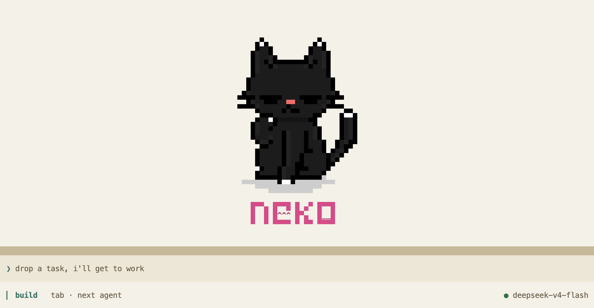
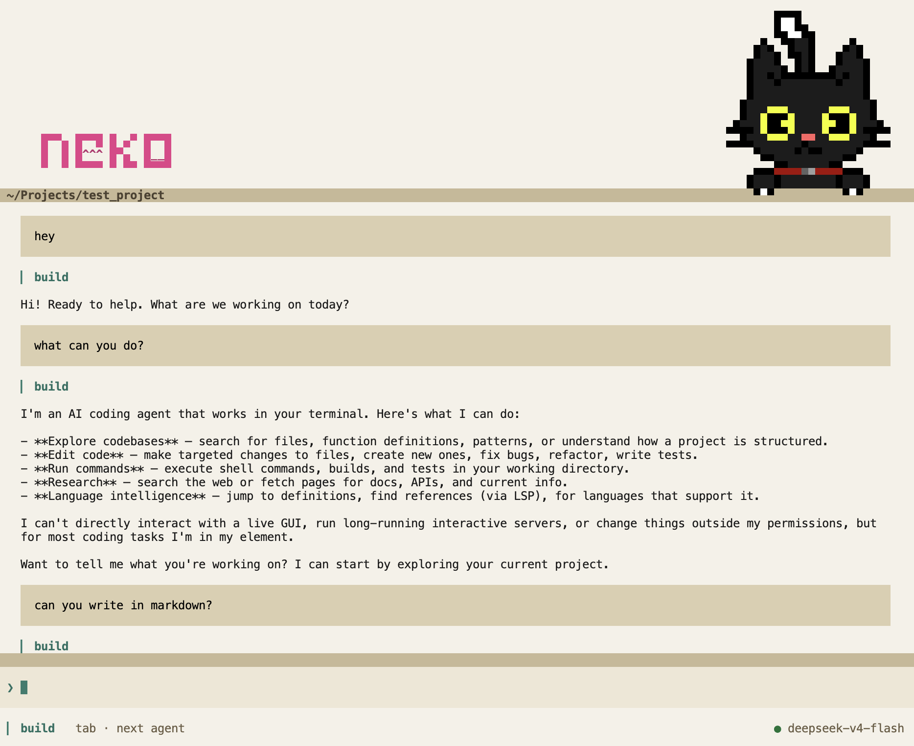

# Neko

A terminal-based AI pair programmer. Single-user by design, two LLM providers, first-class MCP support, fully local storage.

<p align="center">
  
</p>

<p align="center">
  
</p>

## Features

- **Full terminal UI** — SolidJS + OpenTUI, keyboard-driven, warm paper light theme and neutral dark theme
- **2 LLM providers** — Anthropic (Claude), DeepSeek
- **Local storage** — SQLite + JSON event log under `~/.local/share/neko/`, zero cloud calls
- **MCP support** — Model Context Protocol client with OAuth; MCP tools are merged into the LLM's tool catalog so the model can call them directly
- **Built-in tools** — bash, file ops, web, LSP, subagents, and more
- **Named agents** — configurable system prompts, models, and permissions per agent
- **Slash commands** — `/agent`, `/mcp`, `/theme`, `/rename`, `/compact`, `/timeline`, and more
- **@ file mentions** — fuzzy-search files from the current project and drop them into your prompt inline

## Requirements

- [Bun](https://bun.sh) 1.3+ (only needed to build — the compiled binary embeds the runtime)

## Install

Two paths depending on how you plan to use Neko: install a standalone binary for daily use, or run from source for active development.

### Option 1: Install the binary (recommended for users)

Builds a single ~75 MB executable with the Bun runtime embedded. Once installed, `neko` runs in any terminal — no Bun required at invocation time.

```bash
git clone https://github.com/yourusername/neko
cd neko
bun install
bun run build

# System-wide install
sudo mv ./dist/neko /usr/local/bin/neko

# — or — user-only install (ensure ~/.local/bin is on your PATH)
mv ./dist/neko ~/.local/bin/neko

# Verify
neko --version
```

### Option 2: Run from source (recommended for development)

Bypasses the build step so your edits are picked up on the next launch. Requires Bun on the machine at all times.

```bash
git clone https://github.com/yourusername/neko
cd neko
bun install

# Open the TUI
bun run dev

# Any subcommand — pass through with `--`
bun run dev -- run "explain this codebase"
bun run dev -- session list
```

If you'd rather still type `neko` (instead of `bun run dev`) while developing, drop a shell shim on your PATH that execs the source. Since it doesn't rebuild, your edits show up on the next `neko` invocation:

```bash
cat > ~/.local/bin/neko <<EOF
#!/usr/bin/env bash
exec bun run --preload $(pwd)/preload.ts $(pwd)/packages/controller/cli/src/index.ts "\$@"
EOF
chmod +x ~/.local/bin/neko
```

### Uninstall

```bash
rm $(which neko)
rm -rf ~/.local/share/neko    # local session data
```

## Configure

Provider API keys go in `neko.json` in your project directory:

```jsonc
{
  "provider": {
    "anthropic": { "apiKey": "sk-ant-..." },
    "deepseek": { "apiKey": "sk-..." }
  }
}
```

Or manage them interactively via `neko providers`. Keys can also be read from environment variables (`ANTHROPIC_API_KEY`, `DEEPSEEK_API_KEY`).

## Usage

`neko` opens the TUI in the current directory. Open multiple terminals for parallel sessions — each instance binds to its own ephemeral port and shares state via the local SQLite backend.

````bash
# Open the interactive TUI in the current directory
neko

# Open the TUI in a specific project directory
neko ~/code/some-project


## Slash Commands

Type `/` in the TUI to browse. Highlights:

- `/agent` — list, switch to, delete, or create a new agent (name → description → mode)
- `/mcp` — list connected MCP servers (with status), reconnect, delete, or add a new local server (name → command → env)
- `/theme` — pick Light or Dark; stored in `~/.neko/config.json` (restart to apply)
- `/rename` — rename the current session
- `/compact` — summarize the session to shrink the context window
- `/timeline` — jump to a message in the transcript

## Agents

Configure agents in `neko.json`, drop an `AGENTS.md` in your project root, or create them interactively via `/agent`:

```jsonc
{
  "agents": {
    "build": {
      "system": "You are a senior TypeScript engineer focused on correctness and simplicity.",
      "model": "anthropic/claude-sonnet-4-6",
      "permissions": ["bash", "read", "edit", "glob", "grep"]
    },
    "reviewer": {
      "system": "You review code for security issues and performance problems only.",
      "model": "anthropic/claude-sonnet-4-6",
      "mode": "subagent",
      "permissions": ["read", "glob", "grep"]
    }
  }
}
````

Built-in agents: `build` (default), `plan`, `explore`, `general`, plus the internal `compaction` / `title` / `summary` helpers.

## Skills

Skills are reusable prompt templates surfaced in the slash palette. Two locations:

- `<project>/skills/*.md` — project-local, checked into the repo
- `~/.config/neko/skills/*.md` — user-global, available everywhere

Project skills override user skills on name collision. Each file is one skill; the filename (minus `.md`) is the slash-command name. Frontmatter is a small `---` block on top — only `description` is used by the palette:

```markdown
---
description: Explain the architecture of the current file
---

You are a code explainer. When invoked, read the file the user is currently
focused on and produce a concise summary...
```

List what's registered with `neko skill list`.

## MCP Servers

Local (subprocess) or remote (URL). Add via `/mcp` or by editing `neko.json`:

```jsonc
{
  "mcp": {
    "memory": {
      "type": "local",
      "command": ["npx", "-y", "@modelcontextprotocol/server-memory"],
      "environment": {
        "MEMORY_FILE_PATH": "/absolute/path/to/memory.json"
      }
    },
    "github": {
      "type": "local",
      "command": ["npx", "-y", "@modelcontextprotocol/server-github"],
      "environment": { "GITHUB_PERSONAL_ACCESS_TOKEN": "ghp_..." }
    }
  }
}
```

Connected servers' tools appear directly in the LLM's tool catalog (namespaced `{server}_{tool}`), so the model can call them like any built-in.

## Development

See [Install > Option 2](#option-2-run-from-source-recommended-for-development) for launching the TUI from source. The other useful commands:

```bash
bun test             # run tests (uses in-memory model layer, no external services)
bun run typecheck    # type check all packages
bun run lint         # lint all packages
```

Runtime logs (runner traces, tui-server requests) are written to `~/.local/share/neko/neko.log` while the TUI is running, so they don't corrupt the render. Tail that file to debug.

## License

MIT
